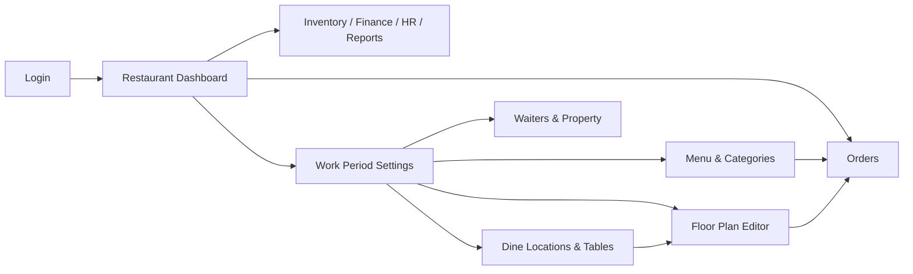

# DineFlow — Client Product Documentation

DineFlow is a full restaurant management system for day-to-day operations: orders, dine-in floor plans, menu management, inventory, finance, HR, events, and reporting. This document explains how to install, configure, and use the **client application** (React + Vite).

**Live preview:** [dineflow01.netlify.app](https://dineflow01.netlify.app/)

---

## Table of Contents

1. [Overview](#overview)
2. [Getting Started](#getting-started)
3. [First-Time Setup Checklist](#first-time-setup-checklist)
4. [Daily Operations Workflow](#daily-operations-workflow)
5. [Authentication](#authentication)
6. [Main Dashboard Modules](#main-dashboard-modules)
7. [Work Period Settings](#work-period-settings)
8. [Dine-In Setup & Floor Plan](#dine-in-setup--floor-plan)
9. [Taking Orders](#taking-orders)
10. [Order Status Lifecycle](#order-status-lifecycle)
11. [Inventory](#inventory)
12. [Finance, Bank & Reports](#finance-bank--reports)
13. [HR & Payroll](#hr--payroll)
14. [Events](#events)
15. [Route Reference](#route-reference)
16. [Environment Variables](#environment-variables)
17. [Troubleshooting](#troubleshooting)

---

## Overview

The client has two main layouts:

| Layout | Path prefix | Purpose |
|--------|-------------|---------|
| **Restaurant Dashboard** | `/RestaurantDashboard`, `/RestaurantOrder`, `/inventory`, `/hr`, etc. | Day-to-day restaurant operations |
| **Work Period Settings** | `/WorkPeriod/*` | Configuration: menu, dine layout, waiters, property, charges |

After login you land on the **Restaurant Dashboard**. Use **Settings** in the top navigation (or go to `/WorkPeriod/Index`) to configure the restaurant before service begins.



---

## Getting Started

### Prerequisites

- Node.js 18+
- Running DineFlow server (see server `DOCUMENTATION.md`)
- PostgreSQL database seeded on the server

### Install & run

```bash
cd restaurant-management-system-client
npm install
npm run dev
```

The app runs at **http://localhost:5173** by default (Vite).

### Build for production

```bash
npm run build
npm run preview   # optional local preview of production build
```

### Connect to the API

Create a `.env` file in the client root:

```env
VITE_API_URL=http://localhost:5000
```

If omitted, the client defaults to `http://localhost:5000`. All API calls use cookie-based authentication (`credentials: "include"`).

---

## First-Time Setup Checklist

Complete these steps in **Work Period Settings** before your first service day:

| Step | Where | What to do |
|------|-------|------------|
| 1 | **Property** → `/WorkPeriod/PropertyInformation` | Enter restaurant name, address, contact, logo |
| 2 | **Charges** → `/WorkPeriod/Settings/Update` | Set VAT % and service charge % |
| 3 | **Currency** → `/WorkPeriod/settings/currency` | Add currencies used for display |
| 4 | **Food Category** → `/WorkPeriod/foodCategory/index` | Create menu categories (e.g. Appetizer, Soup) |
| 5 | **Foods** → `/WorkPeriod/foods/index` | Add menu items with price and category |
| 6 | **Dining Location** → `/WorkPeriod/dine/location` | Create zones (Central, Terrace, Bar, etc.) |
| 7 | **Tables** → `/WorkPeriod/dine/tables` | Add tables under each location |
| 8 | **Floor Plan** → `/WorkPeriod/dine` | Drag zones and tables into layout; positions auto-save |
| 9 | **Waiter** → `/WorkPeriod/RestaurantDineWaiter/Index` | Register staff who serve orders |
| 10 | **Work Period** → `/WorkPeriod/Index` | Start the day’s work period with opening cash |

Optional inventory setup (categories, items, vendors, stock locations) lives under **Work Period → Inventory** and **Main → Inventory**.

---

## Daily Operations Workflow

### Start of day

1. Go to **Settings** → **Work Period** (`/WorkPeriod/Index`).
2. Click **Start Work Period**.
3. Enter **opening cash** when prompted.
4. Confirm status shows **Active work period is running**.

> Only one work period can be open at a time. Orders are linked to the active period automatically.

### During service

1. Open **Order** (`/RestaurantOrder/Orders`).
2. Set order type, waiter, table(s), and guest count.
3. Add items from the food menu.
4. Click **Place Order**.
5. Track order status on the floor plan or order views.
6. Use **Inventory**, **Income**, **Expense**, and **Bank** as needed.

### End of day

1. Return to **Work Period** (`/WorkPeriod/Index`).
2. Click **End Work Period**.
3. Enter **closing cash** when prompted.
4. Review the period row: total sale, payments, discount, on-the-house, etc.

---

## Authentication

### Login

- **URL:** `/`
- **Fields:** Email and password
- **Credentials:** Use `SUPER_ADMIN_EMAIL` and `SUPER_ADMIN_PASSWORD` from the server `.env` (seeded on server startup)

On success you are redirected to `/RestaurantDashboard/Index`.

### Session

- Auth tokens are stored in HTTP-only cookies.
- The client does not manually attach `Authorization` headers; `apiClient` sends `credentials: "include"` on every request.

### Logout

Use the logout action in the header (calls `POST /api/v1/auth/logout`).

---

## Main Dashboard Modules

Access these from the top navigation bar after login.

### Dashboard

- **Path:** `/RestaurantDashboard/Index`
- **Purpose:** Overview of restaurant KPIs and activity.

### Order

- **Path:** `/RestaurantOrder/Orders`
- **Purpose:** Create and manage customer orders (see [Taking Orders](#taking-orders)).

### Event

| Page | Path |
|------|------|
| Dashboard | `/event/dashboard` |
| Manage events | `/event/manage` |
| Create event | `/events/create` |
| Edit event | `/events/edit/:id` |
| Today's events | `/event/today` |

### Inventory (operations)

| Page | Path |
|------|------|
| Home | `/inventory` |
| Purchase | `/inventory/purchase` |
| Purchase details | `/inventory/purchase-details` |
| Pay vendor | `/inventory/pay` |
| Cashback | `/inventory/cashback` |
| Stock in | `/inventory/stock-in` |
| Stock out | `/inventory/stock-out/:id` |
| Move stock | `/inventory/move-stock` |
| Stock by location | `/inventory/location` |
| Locate item | `/inventory/locate/:id` |

Inventory **master data** (categories, items, vendors, etc.) is configured under **Work Period → Inventory**.

### HR

| Page | Path |
|------|------|
| Designations | `/hr/designation/Index` |
| Earning headings | `/hr/earning-heading/Index` |
| Deduction headings | `/hr/deduction-heading/Index` |
| Employee payroll | `/hr/HrEmployeePayroll/Index` |
| Salary payable | `/hr/salary-payable/Index` |
| Grand salary payable | `/hr/grand-salary/Index` |

Nested payroll routes (earnings, deductions, basic salary, payments) use `/hr/employee-payroll/...` paths.

### Income

| Page | Path |
|------|------|
| Income types | `/income/OthersIncomeHead/Index` |
| Manage income | `/income/OthersIncome/Index` |
| Day-wise income | `/income/daily-income` |
| Daily details | `/income/daily-income/details/:day/:month/:year` |

### Expense

| Page | Path |
|------|------|
| Expense types | `/expense/ExpenseHead/Index` |
| Manage expenses | `/expense/manage` |
| Day-wise expense | `/expense/daily-expense` |
| Daily details | `/expense/daily-expense/details/:day/:month/:year` |

### Bank

| Page | Path |
|------|------|
| Banks | `/bank/bankinfo/Index` |
| Branches | `/bank/BankBranchInfo/Index` |
| Accounts | `/bank/BankAccountInfo/Index` |
| Transactions | `/bank/BankTransaction/Index/:accountId` |
| Statements | `/bank/BankStatements/Index/:id` |

### Due

- **Path:** `/due/details`
- **Purpose:** View outstanding dues.

### Report

| Page | Path |
|------|------|
| Current report | `/report/current` |
| Daily statement | `/report/daily` |

### Settings (shortcut)

- **Path:** `/WorkPeriod/Index` (via **Settings** in nav)
- Opens the Work Period settings sidebar.

---

## Work Period Settings

Open any `/WorkPeriod/*` route to use the **Work Period sidebar**.

### Work Period

- **Path:** `/WorkPeriod/Index`
- **Start:** Prompts for opening cash; disabled if a period is already active.
- **End:** Prompts for closing cash; disabled if no active period.
- **Table columns:** Start/end date, opening cash, total sale, discount, cash/card payment, total paid, on-the-house, closing cash, status.

### Food Category

- **List:** `/WorkPeriod/foodCategory/index`
- **Create:** `/WorkPeriod/foodCategory/index/create`
- **Edit:** `/WorkPeriod/foodCategory/index/edit/:id`
- **Fields:** Name, note, serial number (sort order).

### Foods

- **List:** `/WorkPeriod/foods/index`
- **Create:** `/WorkPeriod/foods/index/create`
- **Edit:** `/WorkPeriod/foods/index/edit/:id`
- **Recipe:** `/WorkPeriod/foods/index/recipe/:id`
- **Fields:** Category, food number, name, serial number, availability, price, image.

### Property

- **Path:** `/WorkPeriod/PropertyInformation`
- **Fields:** Name, grade, address, city, state, country, phone, email, VAT/CST/TIN registration, logo, etc.

### Charges

- **Path:** `/WorkPeriod/Settings/Update`
- **Fields:** VAT (%), Service charge (%)
- Click **Edit** to change values, then **Save**.

### Currency

- **List:** `/WorkPeriod/settings/currency`
- **Create / Edit:** `/WorkPeriod/settings/currency/create`, `.../edit/:id`

### Waiter

- **List:** `/WorkPeriod/RestaurantDineWaiter/Index`
- **Create:** `/WorkPeriod/RestaurantDineWaiter/Index/create`
- **Edit:** `/WorkPeriod/waiters/edit/:id`
- **Fields:** Name, note. Waiters appear in the **Served By** dropdown on the order screen.

### Inventory settings (master data)

| Entity | List path |
|--------|-----------|
| Category | `/WorkPeriod/inventory/category` |
| Sub category | `/WorkPeriod/inventory/sub-category` |
| Items | `/WorkPeriod/inventory/items` |
| Brands | `/WorkPeriod/inventory/brands` |
| Stock locations | `/WorkPeriod/inventory/stock-locations` |
| Units | `/WorkPeriod/inventory/units` |
| Vendors | `/WorkPeriod/inventory/vendors` |

Each entity has matching `/create` and `/edit/:id` routes.

---

## Dine-In Setup & Floor Plan

Dine-in uses three layers: **locations** (zones), **tables**, and the **floor plan canvas**.

### Step 1 — Create dining locations

1. Go to **Work Period → Dine → Dining Location** (`/WorkPeriod/dine/location`).
2. Click **Add** / navigate to `/WorkPeriod/dine/location/create`.
3. Enter:
   - **Location Name** (required, min 2 characters) — e.g. `Central`, `Terrace`
   - **Location Type** (required) — e.g. `Indoor`, `Outdoor`, `Bar`, `Private`
4. Click **Save**.

### Step 2 — Create tables

1. Go to **Tables** (`/WorkPeriod/dine/tables`).
2. Click **Add** → `/WorkPeriod/dine/tables/create`.
3. Enter:
   - **Table No** — e.g. `A1`, `KABIN 1`
   - **Capacity** — 1–20 guests
   - **Dining Location** — select from dropdown
4. Click **Save**.

Default table status is **Vacant** (available).

### Step 3 — Arrange the floor plan

1. Go to **Floor Plan** (`/WorkPeriod/dine`).
2. **Drag** zone rectangles to position dining areas.
3. **Drag** table tiles inside zones.
4. Positions **save automatically** when you release a drag.
5. Save indicator shows: `Saving...` → `Saved` or `Save failed`.

**Legend on canvas:**

| Color | Meaning |
|-------|---------|
| Green | Vacant |
| Amber | Reserved |
| Red | Occupied |

When orders are active, tables also reflect **order status** colors (pending, preparing, ready, served).

**Reset Layout:** Clears all saved positions and re-runs the default auto-layout. Requires confirmation.

### Table status (manual)

From the tables list you can update status:

| Status | Meaning |
|--------|---------|
| Vacant | Available for seating |
| Reserved | Held for a booking |
| Occupied | Guests seated / order in progress |

Placing a **dine-in order** automatically marks the primary table as **Occupied**.

---

## Taking Orders

**Path:** `/RestaurantOrder/Orders`

The order screen has three sections:

1. **Order Details** (top) — type, waiter, table, guests, notes  
2. **Food Menu** (left) — browse and add items  
3. **Current Order** (right) — review cart and place order  

### Order details

| Field | Required | Notes |
|-------|----------|-------|
| Order Type | Yes | `Dine In`, `Takeaway`, or `Delivery` |
| Served By | Yes | Select a waiter |
| Table | Yes for Dine In | Multi-select supported; first table is primary |
| Persons | No | Guest count |
| Notes | No | Special instructions |

### Adding items

1. Browse categories in the food menu.
2. Click **+** on an item to add it to the cart.
3. In the cart, adjust quantity, side dish, side dish qty, and per-item notes.
4. Remove items with the trash icon.

### Place order

1. Ensure order type, waiter, and (for dine-in) at least one table are set.
2. Add at least one menu item.
3. Click **Place Order**.
4. On success the cart clears and order details reset.

### Print KOT

**Print KOT** sends a kitchen order ticket (toast confirmation in UI; connect printer integration as needed).

### Multi-table dine-in

Selecting multiple tables stores all table numbers in the order notes. The first selected table is the primary `tableId` and is marked occupied.

---

## Order Status Lifecycle

Orders progress through these statuses:

```
PENDING → PREPARING → READY → SERVED → COMPLETED
                ↘ CANCELLED (at any point via cancel)
```

| Status | UI label | Floor plan color |
|--------|----------|------------------|
| PENDING | Pending | Amber |
| PREPARING | Preparing | Orange |
| READY | Ready | Sky blue |
| SERVED | Served | Violet |
| COMPLETED | Completed | — (table freed) |
| CANCELLED | Cancelled | — |

Update status via order management UI or API (`PATCH /api/v1/orders/:id/status`).

---

## Inventory

### Configuration (Work Period)

Set up categories, sub-categories, brands, units, vendors, stock locations, and items before operational use.

### Operations (Main nav)

1. **Purchase** — record vendor purchases.
2. **Stock In** — add stock to a location.
3. **Stock Out** — remove stock from a location.
4. **Move Stock** — transfer between locations.
5. **Pay** — vendor payments for due purchases.
6. **Cashback** — vendor cashback entries.

---

## Finance, Bank & Reports

### Income & expense

1. Define **heads** (types) under Income or Expense menus.
2. Record individual **entries** under Manage Income / Manage Expenses.
3. View **day-wise** summaries and drill into daily details.

### Bank

1. Create **bank** → **branch** → **account** hierarchy.
2. Record **transactions** per account.
3. View **statements** per account.

### Reports

- **Current report** — snapshot of financial position.
- **Daily statement** — day-level breakdown.

### Due

View consolidated due amounts at `/due/details`.

---

## HR & Payroll

Typical flow:

1. Add **designations**.
2. Define **earning** and **deduction** headings.
3. Create **employee payroll** records.
4. Per employee: manage **basic salary**, **earnings**, **deductions**, and **salary payments**.
5. Review **salary payable** and **grand salary payable** reports.

---

## Events

1. Open **Event → Manage Event** to create bookings.
2. Use **Today's Events** for the daily schedule.
3. **Event Dashboard** for overview metrics.

Events are backed by `/api/v1/inventory/events` on the server.

---

## Route Reference

### Work Period routes

| Route | Page |
|-------|------|
| `/WorkPeriod/Index` | Work period control |
| `/WorkPeriod/foods/index` | Food list |
| `/WorkPeriod/foodCategory/index` | Category list |
| `/WorkPeriod/dine` | Floor plan editor |
| `/WorkPeriod/dine/location` | Dining locations |
| `/WorkPeriod/dine/tables` | Tables |
| `/WorkPeriod/RestaurantDineWaiter/Index` | Waiters |
| `/WorkPeriod/PropertyInformation` | Property info |
| `/WorkPeriod/Settings/Update` | VAT & service charge |
| `/WorkPeriod/settings/currency` | Currencies |
| `/WorkPeriod/inventory/*` | Inventory master data |

### Client services → API mapping

| Service file | Base endpoint |
|--------------|---------------|
| `authService.js` | `/api/v1/auth` |
| `workPeriodService.js` | `/api/v1/work-periods` |
| `foodService.js` | `/api/v1/foods` |
| `foodCategoryService.js` | `/api/v1/food-categories` |
| `dineLocationService.js` | `/api/v1/dine-locations` |
| `dineTableService.js` | `/api/v1/dine-tables` |
| `floorPlanService.js` | `/api/v1/dine/floor-plan` |
| `waiterService.js` | `/api/v1/waiters` |
| `orderService.js` | `/api/v1/orders` |
| `propertyService.js` | `/api/v1/property` |
| `inventoryService.js` | `/api/v1/inventory` |
| `financeService.js` | `/api/v1/finance` |
| `bankService.js` | `/api/v1/bank` |
| `hrService.js` | `/api/v1/hr` |
| `dueService.js` | `/api/v1/due` |
| `reportService.js` | `/api/v1/reports` |
| `dashboardService.js` | `/api/v1/dashboard` |
| `currencyService.js` | `/api/v1/currencies` |

---

## Environment Variables

| Variable | Default | Description |
|----------|---------|-------------|
| `VITE_API_URL` | `http://localhost:5000` | DineFlow server base URL |

---

## Troubleshooting

| Issue | What to check |
|-------|----------------|
| Login fails | Server running; `SUPER_ADMIN_EMAIL` / `SUPER_ADMIN_PASSWORD` in server `.env`; `VITE_API_URL` points to server |
| CORS errors | Server `FRONTEND_URL` must include client origin (e.g. `http://localhost:5173`) |
| Empty menu on order page | Add food categories and foods in Work Period settings |
| No tables in order dropdown | Create dine locations and tables first |
| Cannot start work period | Another period may already be open — end it first |
| Floor plan not saving | Check network tab for `PATCH` to dine-locations or dine-tables; verify auth cookie |
| Orders not linking to period | Server auto-creates a work period if none is open when placing an order |

---

## Tech Stack (Client)

- React 19 + Vite 7
- React Router 7
- Tailwind CSS 4 + shadcn/ui
- react-hook-form, react-rnd (floor plan drag)
- Sonner (toasts)

For API details, data models, and server setup see **restaurant-management-system-server/DOCUMENTATION.md**.
